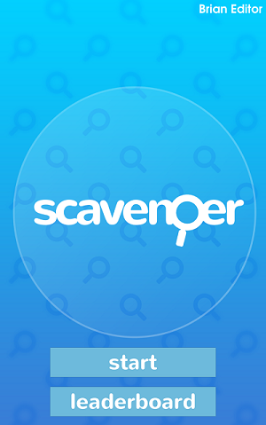

# Scavenger

Scavenger is a game written in Unity for a session presented at [Microsoft Build 2018](https://microsoft.com/build/). The game demonstrates usage of various Azure services:

* [Cognitive Services](https://aka.ms/cogdocs-scavenger)
* [Azure Functions](https://aka.ms/afdocs-scavenger)
* [Cosmos DB](https://aka.ms/cosdocs-scavenger)
* [PlayFab](https://playfab.com/)

The game plays as follows:

* Player opens the game on her mobile device
* If the player hasn't logged in previously, they will create a new name to identify them for the leaderboard
* At this point the player can view the current leaderboard or start playing
* If the player starts the game, they are presented with 5 ordinary (or not!) items to take a picture of
* The player taps one of these items, and then snaps a photo of the item
* The Computer Vision Cognitive Services is triggered to recognize the object in the photo
* If the object is found in the picture, a point is awarded!
* Once all 5 objects are "found", the player has completed the day's challenge, and five new objects will be available the next day

## PlayFab

Before deploying, you will need to register for a free [PlayFab account](https://developer.playfab.com/en-us/sign-up). Once you do that, you need to create a new 'Studio' and a new 'Title', check as described [here](https://api.playfab.com/docs/tutorials/landing-analytics/game-manager-tour). This will generate some credentials (a PlayFab Title ID and Key) which you will need to use when you deploy the game infrastructure. PlayFab is used to authenticate and identify the user as well as to store the leaderboards for the players participating in this game.

## Deployment

One-click deployment via an [Azure ARM template](https://docs.microsoft.com/en-us/azure/azure-resource-manager/resource-group-authoring-templates) is supported.  Just click the button below to deploy the project to your Azure subscription using an Azure Functions Consumption Plan.

The deployment will take some time to execute (due to resource creation and time to pull code from GitHub), so please be patient.

Be aware that App name, Storage account name and Cosmos DB database name must all be globally unique, otherwise, the deployment will fail to complete and you will see an error message in the Azure portal. In this case, you should delete the created Resource Group and try again.

## Running the Functions locally

You can use **Visual Studio 2017**: Open the `Server.sln` file located in the `src\Server` directory. For more details, check [here](https://docs.microsoft.com/en-us/azure/azure-functions/functions-create-your-first-function-visual-studio), you may also need to update [Azure Functions tools](https://docs.microsoft.com/en-us/azure/azure-functions/functions-develop-vs#check-your-tools-version).

Most importantly, in order for the Functions Proxy to work, you should modify the `backendUri` setting in the `Proxies.json` file, replacing the port `80` with `7071` (the local development port of Functions runtime).

## Running the game

The game requires Unity 2018.2 to build and run properly, however earlier versions MAY work.  At the time of writing, you can download the latest 2018.2 Beta [here](https://unity3d.com/unity/beta/2018.2b). Once you have it installed, open the `src/Unity` folder which contains the game code. If you want to test the project in the Editor, you should be running the Functions project locally (check previous paragraph for details). Feel free to modify this behavior in the `Globals.cs` file.

When you open the game in Unity, the [PlayFab SDK](https://api.playfab.com/sdks/unity) is already installed. You should configure it to access your PlayFab data (Studio etc.) by navigating to the **Window > PlayFab > Editor Extensions** menu item. This will open a small window where you sign in with your PlayFab account. After that, you need to configure the game to work with your PlayFab game by modifying the values in the **PlayFab Editor Extensions** window. If the PlayFab sign in worked, you'll be able to easily select your **Studio** and **Title**.

To run the game in the Editor, select the Title scene in the `Scenes` folder and run the project. You can press "Start" to begin the game or "Leaderboards" where you can see the current leaderboard.  For best display, ensure you have set the editor to a Portrait display instead of Landscape (9:16 or 10:16 work best).

## Credits/Special Thanks

* [Joey Buczek](https://github.com/joeybuczek) - Art
* [Eiravaein Works](https://eiravaein.com/) - Sound (via [GDC2015 Game Audio Bundle](https://gamesounds.xyz/?dir=Sonniss.com%20-%20GDC%202015%20-%20Game%20Audio%20Bundle))
* [Dimitris Gkanatsios](https://github.com/dgkanatsios) Testing and review
